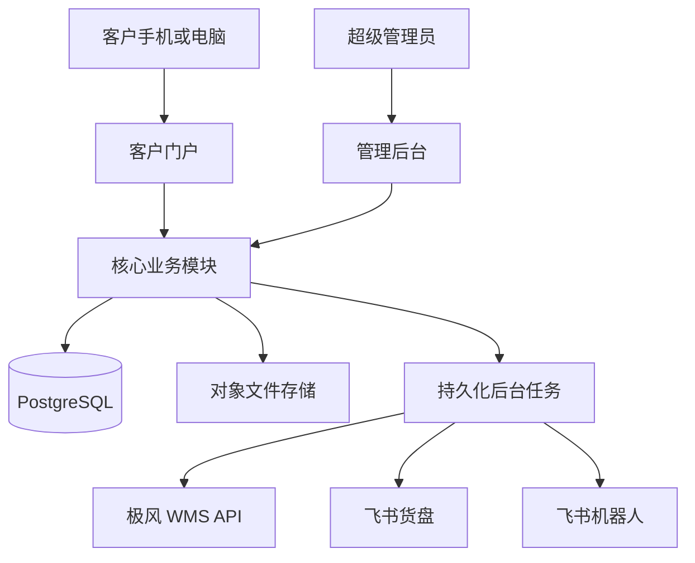

# 同舟行跨境加拿大一件代发平台设计规格

状态：已完成业务访谈和分段设计确认，等待书面规格终审。

## 1. 目标

建设一套面向固定合作店主的一件代发管理系统，以结构化数据库代替人工维护的飞书货盘和订单汇总表。系统连接客户的 TEMU 原始订单、同舟行货盘库存、线下人民币结算、极风加拿大仓履约和飞书公开货盘。

系统成功上线后：

1. 客户选择自己的 TEMU 店铺，直接上传 TEMU 后台导出的原始 Excel，无需人工整理极风模板。
2. 系统校验 SKU、地址、库存和重复订单，生成拿货单并锁定库存。
3. 余额充足的订单自动扣款并推送极风；余额不足的订单通过微信线下付款和管理员核款完成结算。
4. 极风确认发货后，系统正式扣减货盘库存并同步物流状态。
5. 数据库成为唯一真实数据源，飞书货盘只作为外部展示视图。
6. 商品、库存、订单、收款、退款、补发和管理员操作均保留可追溯历史。

## 2. 用户与权限

### 2.1 超级管理员

第一期只有一种后台角色：超级管理员。超级管理员可以管理客户、店铺、商品、SKU、库存、订单、补发、收款、余额、报表、飞书和极风配置。

系统允许创建多个超级管理员账号。每次敏感操作记录实际操作账号，不使用无法区分人员的共享操作记录。

### 2.2 客户

- 客户账号由超级管理员创建、启用或停用。
- 一个客户可以关联多个 TEMU 店铺。
- 客户上传订单前必须选择具体店铺。
- 客户只能查看自己名下的商品价格、店铺、订单、余额、资金流水、物流和统计。
- 客户不能新增、修改或自动匹配 SKU。
- TEMU 最终消费者不登录系统，仅作为一件代发订单的收件人。

## 3. 总体架构

采用模块化一体化 Web 架构：一个代码仓库、一个核心 PostgreSQL 数据库、一个 Web 应用和一个独立后台任务进程。第一期不拆微服务。



### 3.1 技术方向

- Web 与服务端：Next.js、TypeScript 严格模式。
- 数据库：PostgreSQL，使用迁移文件管理结构变更。
- 文件：S3 兼容对象存储，保存原始 Excel、导入结果和商品图片。
- 后台任务：使用 PostgreSQL 持久化队列，避免第一期额外维护 Redis。
- 输入校验：服务端统一验证，不信任浏览器或 Excel 数据。
- 自动化测试：Vitest 负责单元和集成测试，Playwright 负责关键页面流程。
- 时间：数据库保存 UTC；业务报表按 `America/Toronto` 时区的渥太华自然日统计，后台可同时显示北京时间。

所有依赖在项目初始化时锁定确切版本并提交锁文件，不能依赖浮动版本。

### 3.2 业务模块边界

- `identity`：登录、会话、客户访问隔离。
- `customers`：客户、店铺及启停状态。
- `catalog`：商品、SKU、别名、图片和价格。
- `inventory`：总库存、库存锁定、流水和预警。
- `imports`：TEMU Excel 上传、解析、预览和校验。
- `orders`：拿货单、订单状态、价格快照和取消。
- `payments`：余额、线下收款、退款和资金流水。
- `fulfillment`：极风创建、补发、取消、查询、费用和物流状态。
- `feishu`：公开货盘同步和机器人通知。
- `analytics`：日、周、月统计和排行榜。
- `audit`：不可删除的敏感操作审计。

模块通过明确的服务接口调用，不能直接绕过库存或资金服务修改核心余额。

## 4. 核心数据模型

### 4.1 客户与店铺

- `admin_users`：超级管理员账号、密码摘要、启停状态、最近登录信息。
- `customers`：合作客户、联系人、启停状态。
- `customer_users`：客户登录账号及所属客户。
- `stores`：客户名下的 TEMU 店铺、外部店铺标识、显示名称、状态。

### 4.2 商品与价格

- `products`：商品名称、图片、描述和公开展示信息。
- `skus`：标准货盘 SKU、规格、颜色、重量、组合销售、申报价、默认拿货价、销售状态。
- `sku_aliases`：某店铺或全局的 TEMU SKU 货号到标准 SKU 的人工映射。
- `customer_sku_prices`：客户专属价格及生效状态。

成交价优先级为：订单临时改单价 > 客户专属价 > SKU 默认拿货价。订单行保存实际成交价和商品信息快照，后续改价不得改变历史订单。

申报价与拿货价、成交价相互独立，只允许超级管理员维护。

### 4.3 库存

- `inventory_balances`：每个 SKU 的货盘总库存。
- `inventory_reservations`：订单或补发单产生的有效锁定。
- `inventory_movements`：补货、发货扣减、管理员调整和冲正流水。

```text
可售库存 = 货盘总库存 - 有效锁定库存
```

货盘库存是同舟行独立维护的可拿货库存，不等同于极风物理仓库存。第一期补货由管理员手工调整，必须填写数量、原因和备注，并记录操作人、调整前值和调整后值。极风库存接口可以作为核对信息，但不能直接覆盖货盘库存。

### 4.4 导入与订单

- `import_batches`：上传人、客户、店铺、原始文件、文件摘要、校验汇总和时间。
- `import_rows`：每行解析数据、校验结果、错误代码及生成的订单。
- `orders`：客户、店铺、TEMU 主订单号、子订单号、状态、支付期限、收件信息和极风关联。
- `order_items`：标准 SKU、数量、成交价快照、申报价快照。
- `order_events`：订单状态变化、操作来源、原因和时间。

数据库必须建立 `(store_id, temu_sub_order_no)` 唯一约束。重复导入不得产生新的锁定、扣款或极风订单。

一个 TEMU 子订单生成一个系统订单和一个极风包裹。即使多个子订单属于同一 TEMU 主订单，也不自动合并。

### 4.5 资金

- `customer_accounts`：客户当前人民币余额。
- `balance_ledger`：充值、订单扣款、退款、冲正流水。
- `receipts`：微信线下收款、金额、对应订单或充值、确认人和备注。
- `order_settlements`：订单应收、已收、退款和结清状态。
- `fulfillment_costs`：极风物流费、操作费及其订单归属。

所有金额使用人民币分的整数保存，页面格式化为人民币。当前余额与资金流水必须在同一数据库事务中更新。

广告费和 TEMU 平台佣金第一期不计算，但数据模型保留以后添加店铺费用流水的扩展边界。

### 4.6 补发与审计

- `reshipments`：原订单、客户、店铺、补发原因、状态、极风补发关联。
- `reshipment_items`：补发 SKU 和数量，默认商品成交价为零。
- `audit_logs`：操作人、动作、对象、修改前后值、原因、IP 和时间。

订单、资金、库存和审计流水禁止物理删除。纠错使用取消、退款、冲正或新的调整记录。

## 5. TEMU Excel 导入流程

1. 客户选择自己名下的具体 TEMU 店铺。
2. 客户上传 TEMU 后台原始订单 Excel。
3. 系统保存原文件并建立导入批次。
4. 系统解析订单号、子订单号、SKU 货号、数量和收件信息。
5. 系统根据管理员配置的精确 SKU 或别名映射查找标准 SKU，不进行字符串猜测。
6. 系统逐条验证重复订单、SKU、库存、姓名、电话、国家、省市、地址和邮编。
7. 页面分别展示可提交、重复和错误订单及原因。
8. 客户勾选正确订单并确认拿货单金额。
9. 系统在单一事务中创建订单并锁定库存；余额充足时同时完成扣款。

一条错误不得阻止其他正确订单提交。错误订单修正后允许重新上传；重复订单始终拦截。

## 6. 订单、付款与库存状态

### 6.1 余额充足

1. 客户确认拿货单。
2. 系统原子性地锁定库存、扣减余额并写入资金流水。
3. 订单进入 `PAID_PENDING_PUSH`。
4. 后台任务自动推送极风，不需要管理员确认。

任何一步失败时整个事务回滚，不允许出现有订单无扣款、有扣款无订单或锁定数量不完整。

### 6.2 余额不足

1. 客户仍可提交订单并锁定库存，状态为 `PENDING_PAYMENT`。
2. 默认付款期限为提交后 2 小时。
3. 客户通过微信线下付款后点击“我已付款”，状态变为 `PAYMENT_REPORTED`，锁定期限延长至 12 小时。
4. 管理员核款后，可以直接结清该拿货单，或先充值到客户余额再自动扣款。
5. 核款成功后进入 `PAID_PENDING_PUSH` 并自动推送极风。
6. 2 小时内未申报付款，或 12 小时内未核款且管理员未延长，系统自动取消并释放库存。

订单必须一次付清。客户多付的金额由管理员明确选择是否转入余额。

### 6.3 极风履约

状态主线：

```text
PAID_PENDING_PUSH
  -> PUSHING
  -> PENDING_SHIPMENT
  -> SHIPPED
```

调用失败进入 `FULFILLMENT_EXCEPTION`，自动或手动重试后回到 `PUSHING`。每个系统订单使用稳定且唯一的极风业务号，重复重试不能创建重复出库单。

极风确认发货时，系统在同一事务中：

1. 将对应锁定标记为已消耗；
2. 从货盘总库存扣减发货数量；
3. 写入库存扣减流水；
4. 保存物流单号、发货时间和费用；
5. 触发飞书货盘同步和统计更新。

第一期固定使用加拿大邮政。客户不选择物流渠道，后台保留以后增加物流配置的能力。

### 6.4 取消与退款

- 客户只能提交取消申请并填写原因，不能直接取消。
- 管理员处理时必须填写处理备注，并调用极风取消能力。
- 极风取消成功后才释放库存锁定。
- 已付款订单取消成功后，商品款退回客户余额并生成退款流水。
- 已发货订单不能取消，只能进入售后或补发流程。
- 支付超时自动取消时，取消原因固定记录为付款超时。

### 6.5 补发

- 超级管理员从原订单创建补发单，选择 SKU、数量并填写原因。
- 补发单独立锁定库存，商品款默认为零。
- 系统调用极风的补发能力，并保存极风补发编号和物流状态。
- 补发产生的物流费和操作费计入原客户和店铺成本。
- 极风确认补发已发货后扣减货盘总库存。
- 补发数量与普通发货数量分开统计，但库存预警消耗量包含两者。

极风补发接口的准确路径、鉴权和字段以极风提供的正式补发说明为准；该说明是联调前置输入，不改变系统内部补发模型。

## 7. 飞书与极风集成

### 7.1 飞书货盘

- 数据库是唯一真实数据源。
- 飞书只同步公开商品字段、默认拿货价、可售库存和可售状态。
- 客户专属价、锁定库存、预警阈值和内部流水不写入公开货盘。
- 商品、价格、库存或状态变更后创建同步任务，目标是在 1 分钟内完成。
- 每天凌晨执行一次全量比对和修复。
- 飞书端的人工修改会在下一次同步或全量校验时被数据库覆盖。

### 7.2 飞书机器人

机器人只推送内部管理群：

- 库存低于 40 可售天的补货提醒；
- 库存低于 30 可售天的紧急提醒；
- 每日 SKU 发货排行、店铺排行和补发统计；
- 极风接口持续失败、飞书同步失败和任务积压。

客户不加入内部机器人群，只在客户门户查看自己的数据。

### 7.3 极风

极风是 WMS 和仓库履约系统，负责接收出库或补发任务、拣货、发货、物流和费用。新系统是订单、货盘库存和客户结算的业务主系统。

极风集成必须封装创建、补发、取消、查询、费用和状态同步能力，并记录请求标识、响应代码、错误摘要和重试次数。日志不得保存访问密钥或未脱敏的完整收件信息。

## 8. 页面与主要操作

### 8.1 客户门户

- 工作台：当前店铺、余额、待付款、待发货和最近订单。
- 货盘选品：可售 SKU、自己的实际价格和可售库存。
- 上传订单：选择店铺、上传、校验预览、勾选和确认。
- 我的订单：状态、金额、物流单号、取消申请和错误说明。
- 待付款：付款倒计时、“我已付款”和核款状态。
- 余额与流水：余额、充值、扣款和退款。
- 店铺数据：自己名下店铺的订单量、发货量和补发量。

### 8.2 管理后台

- 运营总览：订单、发货、补发、待核款、库存预警和接口异常。
- 客户与店铺：账号、店铺和状态管理。
- 商品与 SKU：公开资料、价格、申报价、别名和销售状态。
- 货盘库存：总库存、锁定、可售、手工调整和历史流水。
- 订单管理：筛选、详情、核款、取消和极风重试。
- 补发管理：从原订单创建、跟踪和统计。
- 收款与余额：直接结清、充值、退款和资金流水。
- 报表分析：日、周、月业务及资金统计。
- 系统与同步：极风、飞书、任务、失败日志和审计。

## 9. 报表与库存预警

所有日报按渥太华自然日统计，底层事件时间保存为 UTC。

### 9.1 每日统计

- SKU 发货排行：普通发货数量、补发数量和合计数量分列。
- 店铺排行：默认按已发货子订单数排序，同时展示发货件数和补发数。
- 当日补发：补发单数、补发件数、原因分布和店铺分布。
- 资金：订单应收、余额扣款、线下收款、退款、极风费用和余额变动。

客户只能查看自己的店铺统计，不显示跨客户排行。

### 9.2 可售天数

```text
最近 7 天日均消耗 = 最近 7 天（普通已发货数量 + 补发已发货数量）/ 7
预计可售天数 = 当前可售库存 / 最近 7 天日均消耗
```

- 日均消耗为零时显示“暂无消耗”，不触发天数预警。
- 预计可售天数少于 40 天触发普通补货提醒。
- 预计可售天数少于 30 天触发紧急补货提醒。

## 10. 异常处理与一致性

- Excel 按行校验，成功与失败相互隔离。
- 库存锁定使用数据库行级并发控制，库存不足时拒绝创建，不产生负库存。
- 余额扣款、资金流水和订单支付状态在同一事务中完成。
- 极风和飞书任务持久化，进程重启后继续执行。
- 外部调用使用指数退避自动重试；达到上限后转人工处理并通知管理员。
- 所有外部写操作设计幂等键，自动重试和人工重试都不能产生重复业务数据。
- 原始 Excel、导入结果、极风业务号和错误摘要保留用于核对。
- 人工修复必须通过受控操作产生新事件，不允许直接修改历史流水。

## 11. 安全、隐私与备份

- 登录使用安全会话 Cookie，密码使用现代自适应密码哈希。
- 生产环境全站 HTTPS，配置和第三方密钥使用部署平台的密钥存储。
- 客户数据查询始终包含客户归属校验，不能仅依赖前端隐藏。
- 收件人姓名、电话和地址在列表、日志和通知中脱敏；订单处理详情按需显示。
- Excel 和图片下载使用短期授权地址。
- 审计日志记录登录、收款、退款、调价、库存调整、补发、取消和配置修改。
- 数据库至少每日备份并保留 30 天；正式上线前必须验证一次完整恢复。
- 生产日志禁止记录密码、访问令牌、签名密钥、完整电话和完整地址。

## 12. 测试策略

### 12.1 单元测试

- 价格优先级和金额计算。
- 订单状态允许的转换。
- 2 小时和 12 小时付款期限。
- 可售库存和可售天数计算。
- 普通发货与补发统计拆分。

### 12.2 集成测试

- Excel 解析、SKU 映射、重复订单和错误隔离。
- 多请求并发锁定最后库存，验证不超卖。
- 余额扣款、充值、直接收款、取消和退款事务。
- 极风与飞书适配器的幂等、重试和错误映射。
- 发货事件对库存、物流和报表的原子更新。

### 12.3 端到端测试

- 客户上传原始 Excel，预览并使用余额自动结算。
- 余额不足、申报付款、管理员核款和自动推送。
- 极风失败后管理员重试。
- 客户申请取消、管理员处理和余额退款。
- 管理员创建补发并查看统计。
- 商品或库存修改后飞书展示更新。

关键库存、资金和重复发货路径必须自动化测试通过后才允许部署。

## 13. 预定项目结构与命令

```text
src/app/                 Next.js 页面、路由和服务端入口
src/modules/             按业务边界组织的领域模块
src/integrations/        极风、飞书和对象存储适配器
src/jobs/                后台任务定义、重试和调度
src/db/                  数据库模型、迁移和事务工具
src/shared/              共享类型、验证和基础设施
tests/unit/              单元测试
tests/integration/       数据库和适配器集成测试
tests/e2e/               Playwright 端到端测试
docs/                    设计、运维和接口文档
```

项目初始化后统一提供以下命令：

```bash
npm run dev
npm run worker
npm run build
npm run lint
npm run typecheck
npm run test
npm run test:integration
npm run test:e2e
npm run db:migrate
```

### 13.1 代码风格示例

```ts
export async function reserveInventory(
  tx: DatabaseTransaction,
  input: ReserveInventoryInput,
): Promise<InventoryReservation> {
  const stock = await tx.inventory.lockBySku(input.skuId);

  if (stock.availableQuantity < input.quantity) {
    throw new InsufficientInventoryError(input.skuId);
  }

  return tx.inventoryReservations.create(input);
}
```

- TypeScript 启用严格模式，不使用无理由的 `any`。
- 领域命名使用英文，界面文字和业务文档使用中文。
- 外部 API 类型与内部领域类型分离，适配器负责转换。
- 核心状态修改只能通过领域服务，不能在页面路由中直接改表。

## 14. 工程边界

### 必须始终做到

- 输入在服务端验证。
- 库存和资金修改使用数据库事务并写流水。
- 外部调用实现幂等、超时、重试和可观察错误。
- 数据库变更使用迁移文件。
- 提交前运行类型检查、测试和构建。

### 必须先确认

- 改变已经确认的付款、库存或订单状态规则。
- 增加在线支付、TEMU API、正式补货单或新的后台角色。
- 更换数据库、部署平台或核心认证方案。
- 将广告费、平台佣金纳入正式利润计算。

### 禁止

- 提交密钥、生产账号或真实消费者个人信息。
- 直接删除失败测试来通过构建。
- 绕过库存和资金流水直接改余额。
- 将飞书或极风数据当作货盘库存的唯一真实来源。

## 15. 第一阶段验收标准

1. TEMU 原始 Excel 可被解析为独立子订单，错误和重复订单有明确提示。
2. 同一店铺重复导入同一子订单不会重复锁库存、扣款或发货。
3. 余额充足订单无须管理员确认，自动扣款并进入极风推送队列。
4. 余额不足订单按 2 小时和 12 小时规则锁定或释放库存。
5. 并发提交不能造成超卖或负库存。
6. 极风确认发货后才正式扣减货盘总库存。
7. 取消成功后释放库存，并将已收商品款退回客户余额。
8. 补发关联原订单，经过极风补发能力发货，扣减库存并单独统计。
9. 飞书货盘在数据变更后 1 分钟内更新，每晚完成全量校验。
10. 库存预警、日报和持续接口异常推送到内部飞书群。
11. 客户无法访问其他客户的店铺、订单、余额、文件或统计。
12. 任意库存数量和客户余额都能追溯到完整流水。

## 16. 第一期不包含

- AI 货品筛选。
- 行业资讯自动化。
- TEMU 店铺 API 自动拉单。
- 在线充值、微信支付接口或分期付款。
- 正式补货单审批流程。
- 广告费和 TEMU 平台佣金的正式计算规则。
- 多级后台角色和审批权限。
- 多物流渠道自动选择。

## 17. 联调和上线前置输入

以下内容需要在对应开发阶段由业务方或服务商提供：

- 极风正式环境基础地址、客户凭证、仓库标识、加拿大邮政渠道标识和补发接口说明。
- 飞书应用凭证、目标货盘文档访问权限、机器人 webhook 或应用机器人权限。
- 客户、店铺、商品、SKU、别名、默认价格、申报价和初始货盘库存。
- 生产域名、云服务器或托管平台账号、对象存储和数据库环境。

这些是联调和上线输入，不影响第一阶段按本规格开发核心系统。
